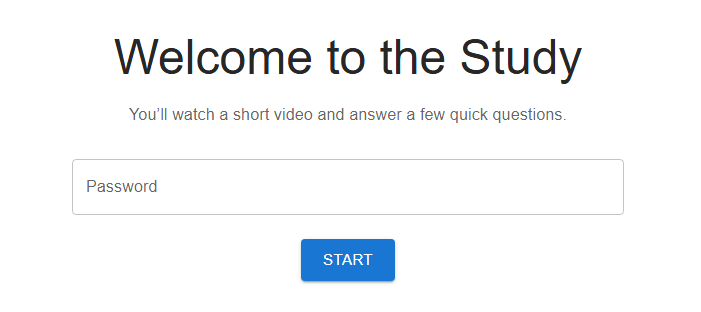
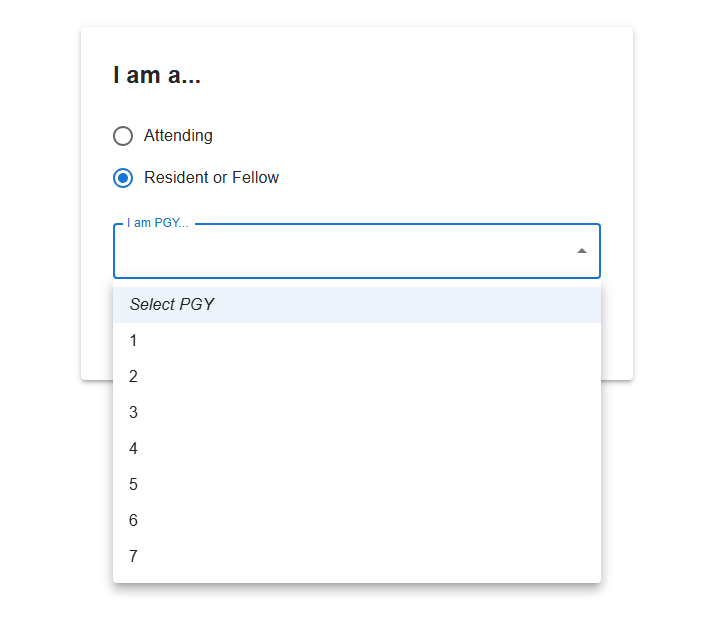
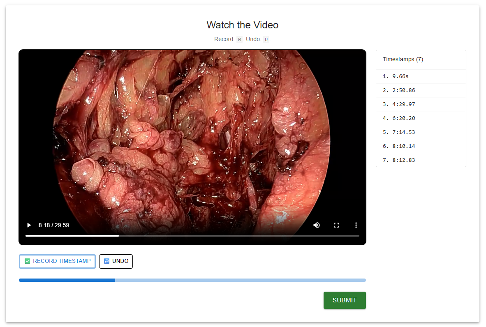
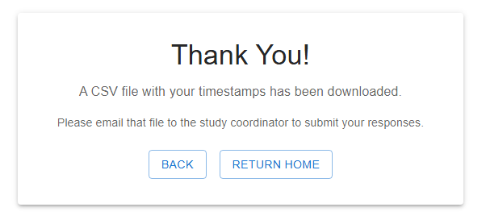
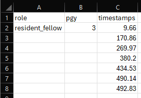

# REFLECT Project

Video annotator to capture timestamps manually marked by survey participants.

## Screenshots

**Welcome (password)**



**I am a... (Attending / Resident or Fellow, PGY)**



**Watch the video**



**Thank you**



**Timestamps / CSV**



---

# React + Vite

This template provides a minimal setup to get React working in Vite with HMR and some ESLint rules.

Currently, two official plugins are available:

- [@vitejs/plugin-react](https://github.com/vitejs/vite-plugin-react/blob/main/packages/plugin-react) uses [Babel](https://babeljs.io/) (or [oxc](https://oxc.rs) when used in [rolldown-vite](https://vite.dev/guide/rolldown)) for Fast Refresh
- [@vitejs/plugin-react-swc](https://github.com/vitejs/vite-plugin-react/blob/main/packages/plugin-react-swc) uses [SWC](https://swc.rs/) for Fast Refresh

## React Compiler

The React Compiler is not enabled on this template because of its impact on dev & build performances. To add it, see [this documentation](https://react.dev/learn/react-compiler/installation).

## Expanding the ESLint configuration

If you are developing a production application, we recommend using TypeScript with type-aware lint rules enabled. Check out the [TS template](https://github.com/vitejs/vite/tree/main/packages/create-vite/template-react-ts) for information on how to integrate TypeScript and [`typescript-eslint`](https://typescript-eslint.io) in your project.

# Dev

## Local

Install dependencies
```bash
npm install
```

Start dev server
```bash
npm run dev
```

Click on the Local URL in the terminal.

## Deploy to GitHub Pages

1. **Repo name**  
   If your GitHub repo is not named `vidstamp`, set the same name in `vite.config.js` → `base: '/your-repo-name/'`.

2. **Install and deploy**  
   From the project root:
   ```bash
   npm install
   npm run deploy
   ```
   This builds the app, adds a `404.html` so routes like `/video` work, and pushes the `dist` folder to the `gh-pages` branch.

3. **Turn on Pages**  
   On GitHub: **Settings → Pages** → Source: **Deploy from a branch** → Branch: **gh-pages** → folder **/ (root)** → Save.

4. **URL**  
   The site will be at `https://CLocs.github.io/vidstamp/` (or your repo name).

